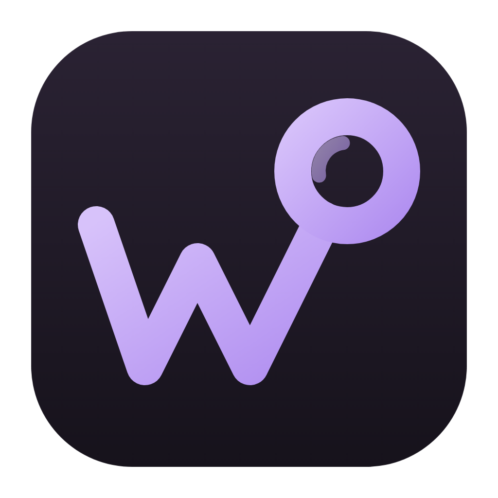
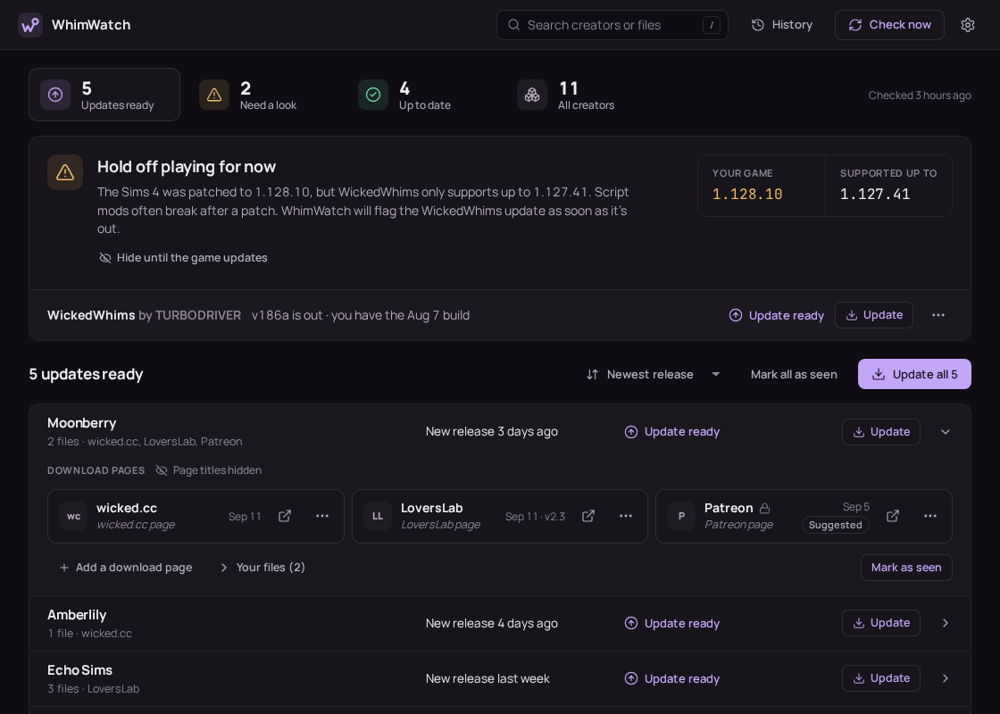
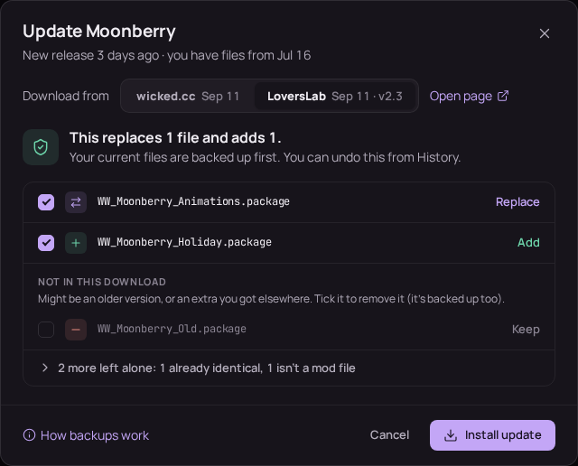
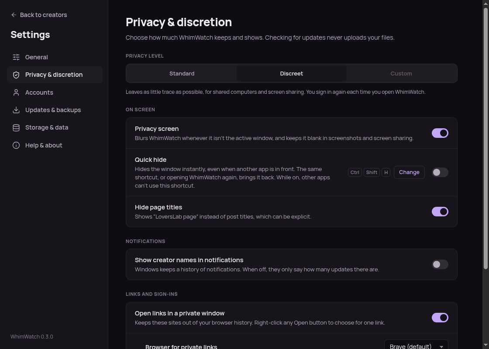

<p align="center">
  
</p>

<h1 align="center">WhimWatch</h1>

<p align="center">
  <strong>An always free, always open-source, always privacy-focused update checker and updater for the WickedWhims Sims 4 mod and its animation packs.</strong>
</p>

## From the Author
I'm forthewhimsy, and I'm a gamer and software dev who was sick of manually curating my WickedWhims animations.

Then I remembered that - unlike my Sims - I actually have agency and I finally did something about it.

Now I want to share that with the rest of the community so that we can all remove the chore of maintaining our library of WW packages, and focus on why we're all gathered here: FUN.

As you probably know if you are here, WickedWhims has no built-in updater, and animation packs are spread across wicked.cc, LoversLab,
Patreon, and other sites. 

WhimWatch scans your Mods folder, works out which creators' packs you have, and tells you when any of them, or WickedWhims itself, has a newer release.

Worth noting, if you are new here:

* WickedWhims is an adult mod. 
* WhimWatch is an independent project and is not affiliated with TURBODRIVER, Electronic Arts, wicked.cc, LoversLab or Patreon.
* WhimWatch is NOT and does NOT condone pirating; In fact, I hope this project removes friction so you can more easily support the rich community of artists and creators who contribute to WickedWhims.

I want to also make this clear - While WhimWatch was built with LLM-assistance, I am a software dev who cares about the quality of what I put out and has the experience and desire to maintain a good product:

I designed WhimWatch to be respectful of privacy, secure, easy-to-use, customizable, and simple to submit improvements and bug reports to.

I encourage all users to be skeptical of any applications built by an anonymous stranger, especially when AI/LLMs are involved - To that end, I encourage users who are suspicious of the files here or anywhere to upload them to antivirus scanner sites like [VirusTotal](https://www.virustotal.com/gui/home/upload) if you want to have some form of confirmation that the files are safe (if you are not a programmer/don't feel like reading through the code yourself).

I do my best to test the application as far as possible, but am limited by the packages and subscriptions I have available to me, so feedback from those on other operating systems, package sites, and other circumstances is vital to ensuring the app handles as many packages as seamlessly as possible:

You can always submit an Issue or PR here with feedback, bug reports, or features, and you can also contact me on reddit at [4thewhimsy](https://www.reddit.com/user/4thewhimsy/).

WhimWatch is free and open source, and always will be. 

I hope you enjoy; If you are so inclined, you can [buy me a coffee](https://buymeacoffee.com/forthewhimsy).

Stay Wicked.

<p align="center">
  
</p>

## What WhimWatch Does

- **Finds your packs automatically.** WickedWhims animation packages name their creator inside the
  file (`animation_author` in its tuning), and many CAS packages do too. The clothing, body and
  object packages that don't are matched by file name instead.
- **Finds where each creator publishes.** It uses the creator list on the
  [WickedWhims download page](https://wickedwhimsmod.com/download), then wicked.cc, then Patreon links
  on those pages. A small [community list](catalog/overrides.json) covers everyone else, and you can
  add or remove links to this list yourself.
- **Checks only the sites you want.** Turn wicked.cc, LoversLab or Patreon off for every creator in
  Settings → General, or for a single creator from their row (for example, Patreon for one creator
  whose membership you don't have). WhimWatch then doesn't contact that site for them or show its
  updates, and remembers the choice.
- **Checks when you click *Check now*** and shows what's out of date. Checking automatically whenever
  WhimWatch opens is a setting, off by default. If the window isn't focused when a check finishes, you
  also get a desktop notification.
- **Updates in one click where it can, or all at once with *Update all*.**
  - wicked.cc downloads are public, so they need no account.
  - For LoversLab or Patreon, sign in inside the app first (with plenty of privacy settings; your credentials are NEVER saved in WhimWatch)
  - The app picks the newest source you can download from. When sources were updated the same day, it
    picks the one with the most files. The update window shows the choice and lets you switch.
  - Before installing, you see exactly which files will be replaced or added, and can untick any.
    Old files are backed up, and every update (or a whole *Update all* run) can be undone from
    **History**, which also lists what you marked as seen.
  - If a download turns out to be identical to what you have (common when a pack reaches a second site
    after early access), it says **Already up to date** instead of reinstalling.
  - Checks and downloads can be cancelled at any time. The final install step (moving files) always
    finishes.
- **Answers "will WickedWhims work when I start The Sims?"** It shows your game version next to the newest one
  WickedWhims supports, and warns when mods or script mods are switched off in the game's options.
- **Stays discreet:** a privacy screen that blurs WhimWatch when it isn't the active window (and keeps
  it out of screenshots and screen sharing on Windows and macOS), a quick-hide shortcut, and hidden
  post titles. Pick *Discreet* during setup to turn these on together.
- **Tells you when a new WhimWatch version is out**, since site changes can break checks until
  WhimWatch is updated.

WhimWatch doesn't need an account to check for updates, and it never uploads anything.

<p align="center">
  
  <br>
  <em>Before installing: which files are replaced, added or left alone, all backed up first</em>
</p>

<p align="center">
  
  <br>
  <em>Settings → Privacy &amp; discretion</em>
</p>

## How it decides something is out of date

| Source | What WhimWatch reads | Needs sign-in to download |
|---|---|---|
| wickedwhimsmod.com | WickedWhims version, release date, supported game version, creator list | — |
| wicked.cc | Page "last updated" date | No |
| LoversLab | File version and "updated" date | Yes |
| Patreon | Title and date of the newest release-like post (including patrons-only posts) | Yes, and your tier must include the post |

Packages don't carry version numbers, so a file's date stands for the version you have. WhimWatch
works out whose file is whose from the author written inside animation packages, and from file names
for the CC packages that carry no author. Where a page names the pack it is for, it is compared
against **your files from that pack** — so an update to one of a creator's packs still shows when
you've installed something newer of theirs since. Where a page names no pack in particular, it is
compared against your newest file from that creator. Either way, more than a day newer means
*Update ready*, and the update downloads from the page that is actually behind. Use **Mark as seen**
if a page changed without a real update. If a download matches your files but another site was updated
later, the update window names that site so you can look there.

Packs of theirs you don't have are listed under the creator with a button to get one, and are never
counted as updates. Turn that off with **Show packs you don't have** in Settings → General.

On the first check, packs you installed by hand may show as updates because their files are older
than the page. The home screen explains this once and offers **Mark all as seen** to start fresh;
anything posted after that shows up again, and History can undo it.

## Install

Download the file for your system from the latest release on the [Releases](../../releases/latest) page:

| System | File |
|---|---|
| Windows 10 and 11 | **`WhimWatch-Setup-x.y.z.exe`**: installs for your user account without administrator rights, then offers to open WhimWatch and to add a desktop shortcut. Or `WhimWatch-x.y.z-portable.exe` to run it without installing. If you run the portable EXE and it looks like it does nothing at all — no window, no error, no nothing — see [below](#the-portable-build-does-nothing). |
| macOS on Apple silicon (M1 and later) | **`WhimWatch-x.y.z-arm64.dmg`**: open it and drag WhimWatch to Applications. |
| macOS on Intel | `WhimWatch-x.y.z-x64.dmg` |
| Ubuntu, Debian, Linux Mint | **`WhimWatch-x.y.z-amd64.deb`**: open it with your software app, or `sudo apt install ./WhimWatch-x.y.z-amd64.deb`. |
| Fedora, openSUSE | `WhimWatch-x.y.z-x86_64.rpm` (`sudo dnf install ./WhimWatch-x.y.z-x86_64.rpm`) |
| Other Linux | `WhimWatch-x.y.z-x86_64.AppImage`: make it executable, then run it. |

Every release also has `SHA256SUMS.txt` to check your download against, and the source code.

Builds are not code-signed, so the first launch needs one extra step:

- **Windows:** SmartScreen shows "Windows protected your PC". Click **More info → Run anyway**. The
  portable `.exe` has no Start menu entry, so Windows may not show its desktop notifications; the
  installer doesn't have this problem.
- **macOS:** the first time, macOS says it can't check WhimWatch for malicious software. Open **System
  Settings → Privacy & Security** and click **Open Anyway** (on macOS 14 and earlier, you can also
  right-click the app and choose **Open**).
- **Linux:** on Ubuntu 24.04 and later, AppImages can fail to start because of a sandbox restriction.
  Use the `.deb` instead.

### What happens if the portable build does nothing (and what to do about it)

The portable `.exe` unpacks itself into a folder under `%TEMP%` and runs from there. If something
held a file open while it was unpacking — antivirus scanning it, or a previous copy still running —
that folder can end up missing a file Windows needs, and then nothing happens at all: No window, no
error message, and nothing in WhimWatch's own log, because it fails before any WhimWatch code runs.

From version 0.2.0, each launch unpacks into its own folder, so a damaged one is never used twice. On 0.1.1 and earlier, open `%TEMP%` in File Explorer, delete the folder holding `WhimWatch.exe` (its name is a long string of letters and numbers), and run the portable `.exe` again. Or use the installer, which doesn't unpack anything.

WhimWatch finds `Documents/Electronic Arts/The Sims 4/Mods` on its own. It also handles localized
folder names, OneDrive-redirected Documents, and Steam/Proton on Linux. You can add other folders
too.

## Privacy and safety

- **Checking** only happens when you click *Check now*, unless you turn on checking when WhimWatch
  opens (and choose how often). It only reads public pages, and requests are spaced out per site. Your files are never uploaded, but the
  sites can see which creators' pages are checked from your connection, as with any visit.
- **Signing in** opens the site's own login page in an app window. WhimWatch never sees or stores
  your password; it keeps only the cookies the site sets, encrypted at rest (Windows DPAPI, macOS
  Keychain, or the Linux keyring; on Linux without GNOME Keyring or KWallet the encryption is only
  nominal, and Settings says so). *Sign out* deletes them.
- **Downloads** only come from wicked.cc, LoversLab, Patreon, Mega or Google Drive over HTTPS.
- **Archives** are checked before anything is unpacked. Downloads with unsafe paths or programs
  (`.exe`, scripts…) are refused, and only `.package`/`.ts4script` files are installed.
- **Installing** refuses to run while The Sims 4 is open. Replaced files go to a backup folder, and
  the game's `localthumbcache.package` is cleared so thumbnails refresh.
- **Old packages:** a downloaded file replaces the installed file with the **same name**. Installed
  files from that creator that aren't in the download are listed but kept, unless you tick them for
  removal. *Update all* never removes anything.
- **Backups** are deleted after 30 days by default (Settings → Updates & backups: 7, 30 or 90 days, or
  never). Settings → Storage & data shows how much space they use and can delete them all. Once a
  backup is gone, that update can't be undone.
- **Browsing data:**
  - LoversLab and Patreon are read in a built-in browser. While checking, it loads only the site's own
    pages and scripts and Cloudflare's check: no images, embeds, ads or analytics from other companies.
  - Its cache, site storage and visit records are wiped when WhimWatch closes, and any leftovers are
    removed on the next start. You stay signed in unless you turn on "Also forget sign-ins", and only
    the sites' own cookies are kept: other companies' cookies are deleted too. With "Also forget
    sign-ins" on, the built-in browser keeps everything in memory and writes nothing to disk at all
    (if you turn it on after using LoversLab or Patreon in that session, from the next start).
  - Leftover downloads are removed when you cancel an update and on every start.
  - Backups are full copies of the mod files an update replaced, stored outside the Mods folder until
    they expire or you delete them.
- **Links** can open in a private window of any installed browser (right-click an Open button, or
  Settings → Privacy & discretion). Desktop notifications don't name creators unless you enable it,
  since Windows keeps notification history.
- **Privacy levels:** setup asks you to pick *Standard* or *Discreet* (neither is preselected).
  Discreet turns on the privacy screen, hidden post titles, private-window links, forgetting sign-ins
  and 7-day backups together; changing any setting on that page makes the level *Custom*. **Quick
  hide** is an opt-in system-wide shortcut (Ctrl+Shift+H by default, changeable) that hides the window
  at once. It's off in both levels, because while it's on, other apps can't use that shortcut.
- **In your computer's app lists** (Start menu, installed programs, Linux app menus) WhimWatch is
  described only as "Keeps track of updates for your mods".
- **Logs** keep only the site name of any web address (never the page), hide your home folder, and stay
  small. *Diagnostics…* shows exactly what a bug report would include before you copy or save it.
- **Account risk:** sites have different terms around automated downloads and these terms change all the time: If you experience any account flagging or issues, please report them to me so I can try to do my best to address it. WhimWatch downloads only when you ask, one file at a time. The *install automatically* setting is off by default and only applies to wicked.cc.

### Network connections

WhimWatch only connects to these, and only when you check, update or sign in. wicked.cc, LoversLab and
Patreon can each be turned off (for every creator in Settings → General, or per creator), and then
aren't contacted for those creators:

| Host | When | Why |
|---|---|---|
| `wickedwhimsmod.com` | Every check | WickedWhims version and the creator list |
| `wicked.cc` (and `files.wicked.cc`) | Every check; updates | Pack pages; downloads |
| `www.loverslab.com` | Checks of creators with LoversLab pages; updates | File pages; downloads when signed in |
| `www.patreon.com` (and `patreonusercontent.com`) | Checks of creators with Patreon pages; updates | Newest posts; attachments when signed in |
| `challenges.cloudflare.com` | When LoversLab or Patreon show a human check | Cloudflare's check |
| `raw.githubusercontent.com` | Every check | The community creator list (`catalog/overrides.json`) |
| `api.github.com` | At most once a day (can be turned off) | Whether a newer WhimWatch is out |
| Mega (`mega.nz` and its API servers), Google Drive (`drive.google.com`, `drive.usercontent.google.com`) | Only when an update's download is hosted there | Downloads |

There is no telemetry, crash reporting or analytics. The sign-in windows, and the window that opens
when a site asks for a human check, are ordinary web pages: they load the site's full page, including
its images, embeds, ads and analytics (and, for sign-in, things like a "Continue with Google" button).
Only the hidden windows used for checking are limited to the table above.

### Your data on disk

Everything WhimWatch stores (settings, check results, sign-ins, backups, logs) lives in one place per
system, plus leftover downloads in the temp folder:

| System | Data | Logs |
|---|---|---|
| Windows | `%APPDATA%\WhimWatch` | `%APPDATA%\WhimWatch\logs` |
| macOS | `~/Library/Application Support/WhimWatch` | `~/Library/Logs/WhimWatch` |
| Linux | `~/.config/WhimWatch` | `~/.config/WhimWatch/logs` |

**Settings → Storage & data → Remove all data** closes WhimWatch and deletes all of it (the Mods folder isn't
touched). On Windows, uninstalling also asks whether to remove it.

Deleting a file doesn't overwrite it: until the space is reused, deleted data (including backups of
replaced mods) may be recoverable with disk tools, and SSDs or cloud-synced folders may keep copies.
If that matters to you, the real protection is full-disk encryption (BitLocker or Device Encryption on
Windows, FileVault on macOS, LUKS on Linux) and a password on your user account.

## Limitations

- A page that names no particular pack — "someone's animations for WickedWhims", or a Patreon post
  covering everything a creator just released — is dated against your newest file from that creator,
  because nothing in its name says which of your files came from it. Installing from that page
  through WhimWatch keeps that honest: your files are stamped with the day you installed, so
  anything the creator posts afterwards still shows. It only goes wrong if files from that creator
  arrive another way — installed by hand, or from a second site — and are newer than an update on
  that page you haven't taken yet.
- Sorting a creator's pages into "packs you have" and "packs you don't" is wicked.cc only, because
  that is the one site where a creator has a page per pack. WhimWatch follows a single LoversLab or
  Patreon entry per creator — whichever release they posted most recently — so judging that entry by
  its name would mute the whole site for them rather than set one pack aside.
- Patreon posts are matched by title ("Animations", "Update", "v1.2"…). A release with an unusual
  title may be missed; polls and previews are ignored.
- Replacement is by file name. If a creator renames a pack between versions, the old file stays unless you
  tick it under "Not in this download", so both may be installed.
- Cloudflare sometimes asks for a human check. WhimWatch then shows a *Verify* button that opens the
  site so you can complete it. It leaves that site alone until you do, so the rest of the check isn't
  held up; the window closes itself once you're through, and a check still running carries on.
- **An account made with Google needs a password before you can sign in here.** Google won't sign
  anyone in from inside another app (it shows "This browser or app may not be secure"), so *Continue
  with Google* can't finish in the sign-in window, and nothing WhimWatch does can change that. For an
  account made with Google, Patreon turns the email box down as well ("Log in with your Google
  account"). The way through: open [Patreon](https://www.patreon.com/login) in your browser, sign in
  with Google there, and set a password under **Settings → Account → Login → Set Password**, then sign
  in here with your email and that password. The password is an extra way in, not a swap: Google still
  signs you in everywhere else. WhimWatch never sees it; it only keeps the login cookie the site sets. Accounts that already have a password, or that sign in with an emailed code, work in the
  sign-in window as they are — and checking for Patreon updates needs no account at all, only
  downloading does.

## Development

Requirements: Node.js 22 (the version in `.nvmrc`) and npm.

```bash
npm ci
npm run dev        # run the app with hot reload
npm test           # unit tests (Vitest)
npm run lint
npm run typecheck
npm run dist       # build installers for the current OS into dist/
```

Handy tools:

```bash
npm run scan -- "<path to Mods>"      # full check from the terminal (wickedwhimsmod.com + wicked.cc only)
npm run scan:app -- "<path to Mods>"  # full check of every source through Electron (needs a display)
npm run smoke                         # live checks of wickedwhimsmod.com and wicked.cc
npm run smoke:app                     # live checks of all sources through Electron
```

On Linux/WSL, Electron needs GUI libraries, e.g.
`sudo apt-get install libgtk-3-0 libnss3 libasound2 libgbm1 libxss1 libxtst6`.

### Layout

```
src/core/       platform-independent logic (no Electron): package reader, scanner, sources,
                check orchestration, archive extraction, installer
src/main/       Electron main process: hidden browser for Cloudflare sites, sign-in,
                downloads, updater, IPC
src/preload/    the typed bridge exposed to the window
src/renderer/   React UI
src/shared/     types shared by all of the above
catalog/        community-maintained creator links and aliases
test/           unit tests with hand-written fixtures (never real mod files)
```

Releases are built by GitHub Actions from version tags.

## Feedback and contributing

- **In the app,** the **?** menu next to Settings opens this guide and the bug report and feature forms,
  and Settings → Help & about has every form.
- **Found a bug, or a site stopped working?** [Open an issue](../../issues/new/choose) and pick the
  matching form. For bugs, include Settings → Help & about → **Diagnostics…** (it has the end of the log and no
  creator names or page addresses).
- **Have an idea, or know a creator WhimWatch misses?** [Open an issue](../../issues/new/choose) with
  the *Feature idea* or *Add or fix a creator link* form.
- **Want to change the code?** Fork the repository, make your change on a branch, and open a pull
  request against `main`. Tests run automatically on every pull request. [CONTRIBUTING.md](CONTRIBUTING.md)
  walks through it, and lists the most useful contributions (missing creators in
  `catalog/overrides.json`, and fixes when a site changes its layout).
- **Security problems:** please report them privately, as described in [SECURITY.md](SECURITY.md).

Changes are listed in [CHANGELOG.md](CHANGELOG.md).

## License

WhimWatch is free and open source under the [MIT License](LICENSE).

It includes third-party software under its own licences, all compatible with that: the
[Manrope](https://github.com/sharanda/manrope) and [JetBrains Mono](https://github.com/JetBrains/JetBrainsMono)
fonts (SIL Open Font License 1.1), [Lucide](https://lucide.dev) icons (ISC), React (MIT), Electron and
Chromium, 7-Zip (GNU LGPL) and UnRAR (freeware licence) for unpacking downloads, and a few MIT, ISC and
BSD libraries. [THIRD_PARTY_NOTICES.md](THIRD_PARTY_NOTICES.md) has the details; the full licence texts
ship with the app and are shown in Settings → Help & about → **Licences**.

WickedWhims is TURBODRIVER's work, and The Sims is a trademark of Electronic Arts. WhimWatch isn't
affiliated with either, or with wicked.cc, LoversLab or Patreon.
